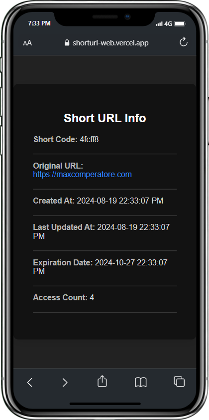

# URL Shortener Web Application

A streamlined and user-friendly web application designed for shortening URLs, built using Flask. This project leverages the **Blinlink API**—also developed by me—as its backend to handle all URL shortening functionalities.




## Features

- **URL Shortening**: Quickly generate shortened versions of any valid URL.
- **Redirection**: Seamless redirection to the original URL when a shortened link is accessed.
- **URL Information**: Access detailed information about shortened URLs, including the number of times they've been accessed.
- **URL Deletion**: Delete shortened URLs that are no longer needed.
- **URL Update**: Update the destination of existing shortened URLs with ease.

## Getting Started

The application is live and can be accessed here: [https://shorturl-web.vercel.app/](https://shorturl-web.vercel.app/).

## Project Goals
- Deepen understanding of database management, API design, and security fundamentals through hands-on implementation.
- Build a scalable and secure URL shortening service, mastering backend development with Flask.
- Enhance backend development skills by creating a robust and efficient API to power the URL shortener.

### Local Setup

If you want to set up and run the project locally, follow these steps:

1. **Clone the repository**:
   ```bash
   git clone https://github.com/pyoneerC/shorturl-web.git
   cd url-shortener-web
   ```

2. **Install dependencies**:
   ```bash
   pip install -r requirements.txt
   ```

3. **Run the application**:
   ```bash
   python app.py
   ```

4. **Access the application**: Open your browser and go to `http://127.0.0.1:5000/` to use the URL shortener.

## About Blinlink API

The Blinlink API is the powerful backend service that drives this application. It is a fully-featured URL shortening service I developed, offering comprehensive functionalities such as:

- Creating shortened URLs
- Retrieving original URLs
- Updating existing shortened URLs
- Deleting shortened URLs

Explore the Blinlink API's source code here: [Blinlink API on GitHub](https://github.com/pyoneerC/BlinkLink/blob/main/main.py).

## Contributing

Contributions are highly encouraged! If you'd like to improve this project, feel free to fork the repository, make your changes, and submit a pull request. 

## License

This project is licensed under the MIT License.

## Contact

If you have any questions, suggestions, or issues, please don't hesitate to contact me at [maxcomperatore@gmail.com](mailto:maxcomperatore@gmail.com).

---
